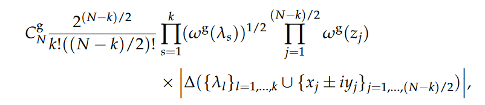
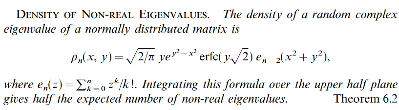
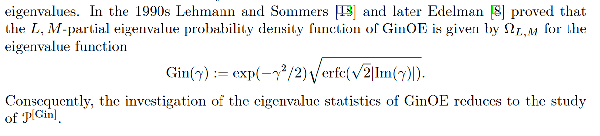

## Computational random for matrix theory
https://robertsweeneyblanco.github.io/Computational_Random_Matrix_Theory/Home/Home.html

- tracé les vp des matrices de ginibre 1000 fois en 16 16 permet en quelques sortes de visualiser la proba que chaque point du cercle a d'être une valeur propre. L'effet Saturne traduit le fait que proche de l'axe des réels, ces points ont moins de chance d'être des valeurs propres.
- https://arxiv.org/abs/2205.15054
- The Random Matrix Technique of Ghosts and Shadows, Alan Edelman: peut etre interessant pour approcher le comportement des matrices de ginibres via goe ou gue ou des ensembles fantomes comme il dit
- Pour GOE et GUE: plus la taille de la matrice est importante, plus les valeurs propres on un espacement qui est de plus en plus petit. Une idée serait de tracer les valeurs propres de la matrice de ginibre est de regarder si les écarts entre ces valeurs sont plus importants pour les valeurs propres les plus faibles, fortes ou si c'est aléatoire...
- https://arxiv.org/abs/math-ph/0501068 ODE solver (à lire vite f): Prolate matrix interessant 
- https://arxiv.org/abs/solv-int/9509007 Tracy distribution (à lire vite f les cas limites ou N grand)
- Theorem (Bauer-Fike): Let A∈Cn×n be a diagonlizable matrix such that A=VDV−1 (where V is a matrix of eigenvectors and D is a diagonal matrix of corresponding eigenvalues) and E∈Cn×n. If μ is an eigenvalue of A+E then there exists an eigenvalue of A, denoted λ, such that|μ−λ|≤κ(V)||E||: lien avec une des publis sur ce nombre et le comportement des matrices de ginibre réelles en fonction de si on les perturbe avec une matrice complexe de norme faible: lien avec l'effet saturne.
- https://arxiv.org/abs/1912.08805 pseudospectral shattering
- Perturbation par une matrice de ginibre pour trouver le pseudo spectre: théorème de Banks,Garza Vargas, Kulkarni, et Srivastava
- RADM méthode: très fort pour diagonaliser informatiquement une matrice stochastique sans qu'il n'y ait trop d'erreur

- The motion of these eigenvalues is known as Dyson Brownian Motion. The process of the path satisfies the following Stochastic Differential Equation dλi=dBi+∑1≤j≤n:j≠idtλi−λj. Cela pourra peut-être être uti de regarder les valeurs propre des matrices lorque celles si sont perturbées pour voir l'évolution de l'effet saturne lors de la perturbation
- According to How many Eigenvalues of a Random Matrix are Real by Alan Edelman, Eric Kostlan, Michael Shub if En is the number of real eigenvalues for a n×n matrix where the entries are standard normal then $lim_{n\rightarrow \infty} \frac{E_n}{\sqrt{n}} = \sqrt{\frac{2}{\pi}}$. On pourra vérifier ce résultat en l'appliquant ax matrices de ginibre pour comprendre pourquoi on a plein de valeurs propres sur l'axe des réels
- prendre plusieurs petites matrices de ginibre pour regarder l'ensemble de leurs valeurs propres commune permet de voir un effet saturne contrairemebt à quand on a une seule grosse matrice car la deuxième option introduit une dépendance entre les valeurs propres de la grosse matrice qui renvoie probablement une densité biaisée

## Matrix theory, Mehta
- th 11.5.2 permet de savoir dans quel cercle les vp d'une matrice sont contenues.
- th 11.5.3: peut être utile à tester: permet d'avoir une localisation ds vp qui cette fois-ci dépend de la valeur propre et n'est pas global
- idem pour th 11.5.4: si l'on voit en traçant les ovals que les recoupent sont peu présentes autour de l'axe des abcisses, alors les chances d'avoir une vp proche de cet axe sont minces.

## PROGRESS ON THE STUDY OF THE GINIBRE ENSEMBLES I: GinUE (stop p 8)
https://arxiv.org/pdf/2211.16223.pdf
- In 1.10: we can see that it is the log equation of 1.7(GinUE) corresponds for a Coulomb gas
- 1.10: Also in the early 1980’s, for all positive values of β/2 odd, (1.10) gained attention as
the absolute value squared of Laughlin’s trial wave function for the fractional quantum Hall
effect [243].

## PROGRESS ON THE STUDY OF THE GINIBRE ENSEMBLES II: GinOE AND GinSE (stop p 17 mais j'avais pas tout compris avant, reprendre au moins a correlation fonction)
https://arxiv.org/pdf/2301.05022.pdf
- 1.7: PDF for a GinOE matrix with k real eigenvalues equals to: 
- la répulsion existe dans le cas réel et pas dans le cas complexe à cause de la structure pfaffienne? Quand est-il de GinSE?
- comprendre le 2.2 du Coulomb gas
- comprendre ce que sont les skew polynomials (à quoi servent-ils)
- fonction de corrélation entre les vp réelles

## The Probability that a Random Real Gaussian Matrix has k Real Eigenvalues, Related Distributions, and the Circular Law
https://core.ac.uk/download/pdf/82140233.pdf
- Density of non real eigenvalues: 

## The Ginibre ensemble of real random matrices and its scaling limits (page 6 reprendre au 4.)
Zotero

- Parle d'applications à la physique dans l'introduction
- introduction des point process methods via la théorie de la mesure et l'usage de probabilités pour en déduire une fonction de corrélation entre les différentes valeurs propres.
- Formule de la densité de probabilité partielle pour L vp réelles 